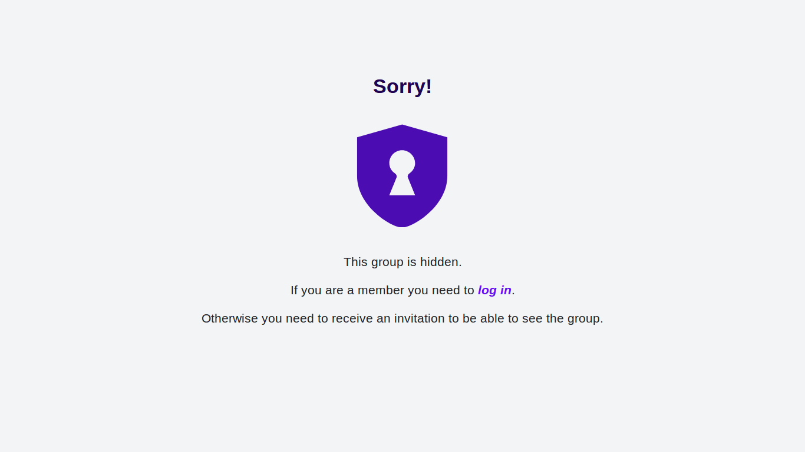
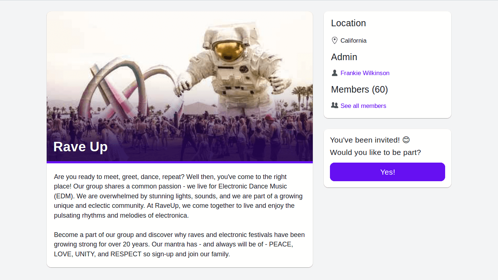
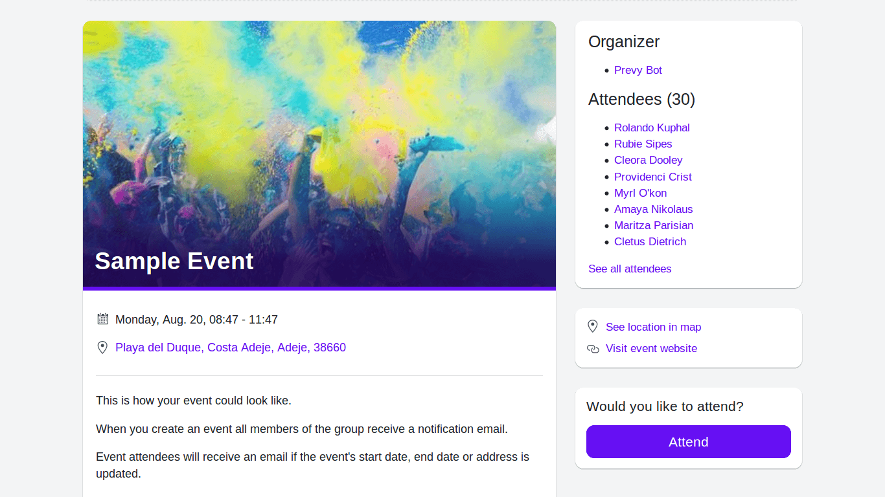
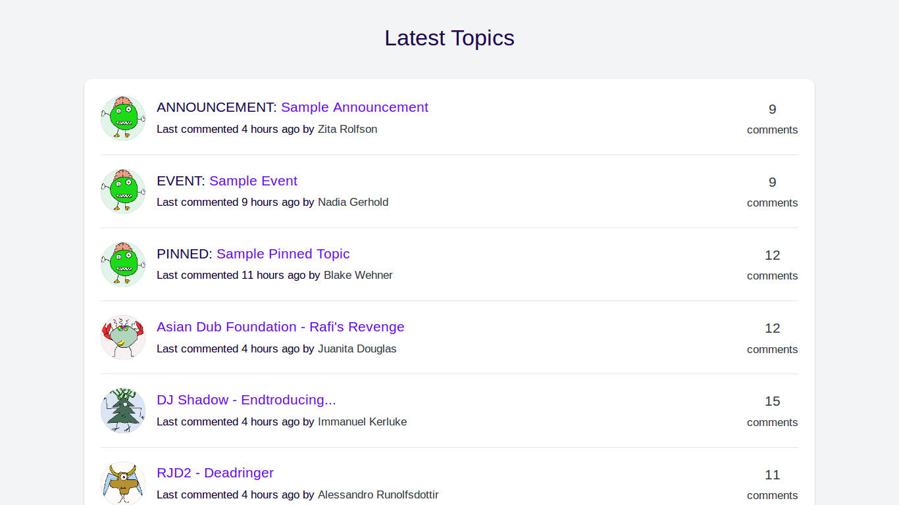
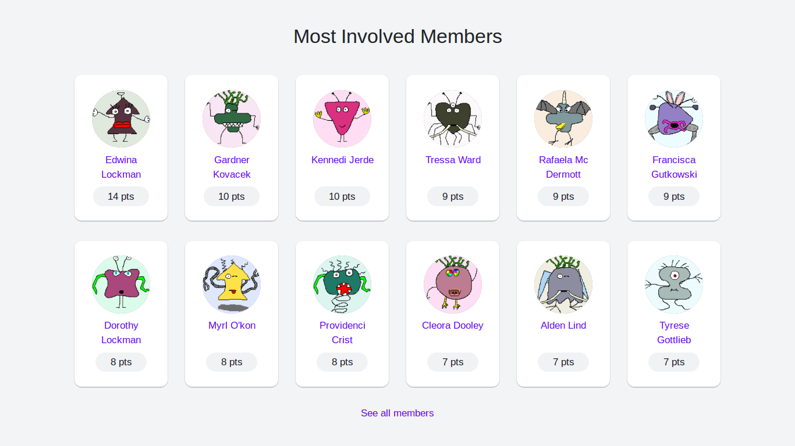

 

# Prevy

A platform to build private communities that revolve around private events.

## Demo

[prevy.herokuapp.com](https://prevy.herokuapp.com/)

## Built With

- Ruby on Rails 5
- Minitest
- Capybara
- Coffeescript
- Devise
- Pundit
- Rolify
- Sucker Punch
- PG Search
- Storext
- ActiveRecord Import
- Geocoder
- Leaflet API
- Cloudinary

See the [Gemfile](Gemfile) for more information.

## Features

- Everything is *private* by default
- Groups can be *hidden*
- People need to *request membership* or *be invited* to become group members
- Only *members* and *invitees* can see hidden groups
- Only *members* and *invitees* can see a group's contents
- Every group has its own *forum*, to discuss anything comfortably
- Group members are rewarded with *points* for commenting, creating topics, and attending events
- All members of a group can be set as organizers by default
- In-app and email notifications

## Screenshots

<kbd>
  
</kbd>  
&nbsp;
<kbd>
  
</kbd>  
&nbsp;
<kbd>
  
</kbd>  
&nbsp;
<kbd>
  
</kbd>  
&nbsp;
<kbd>
  
</kbd>
